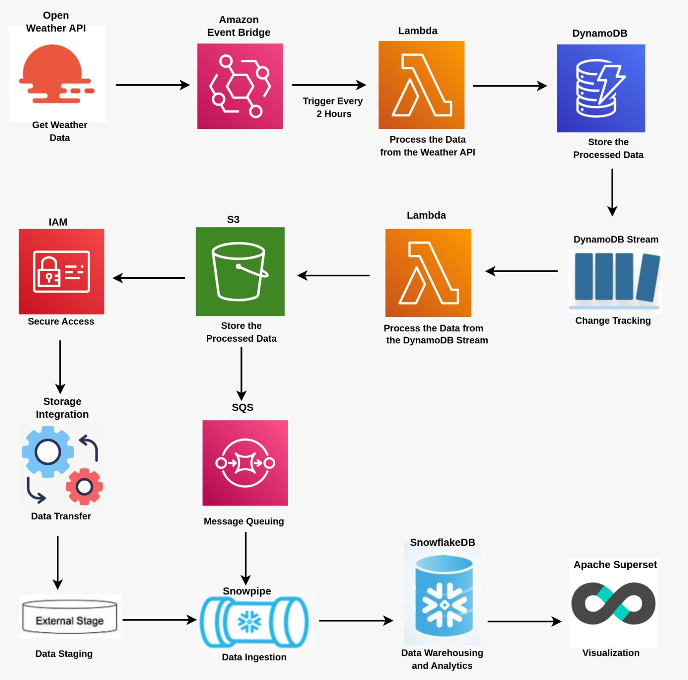
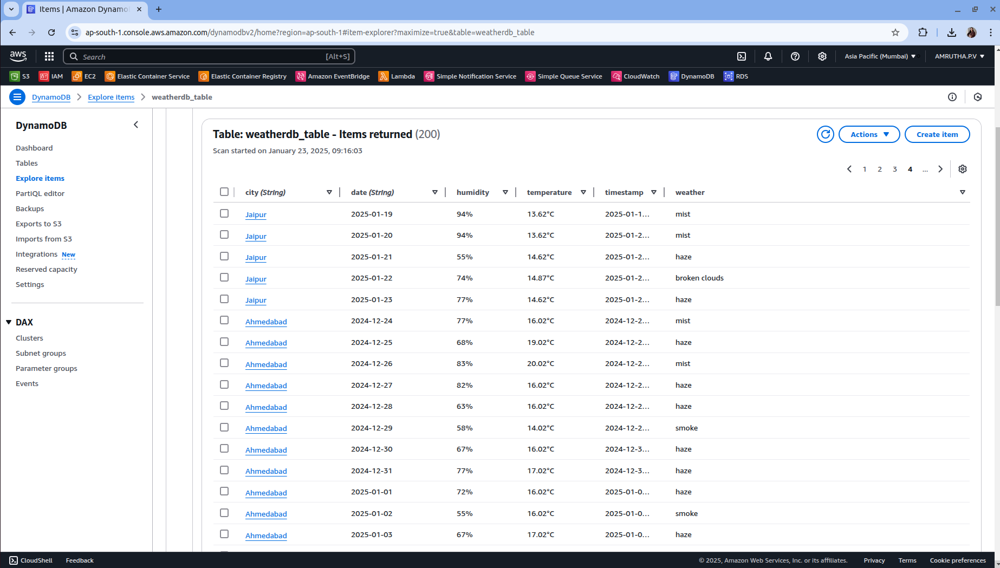
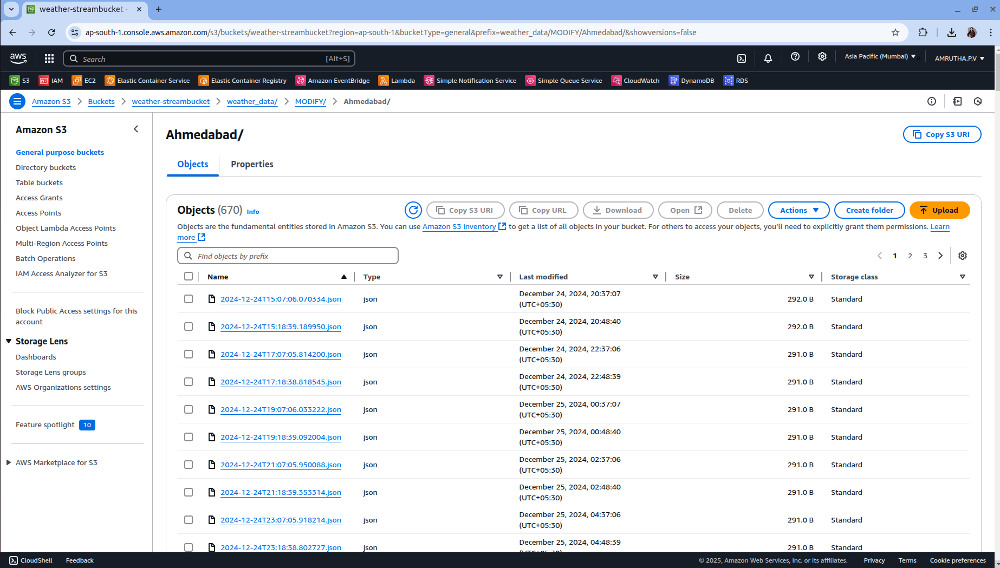
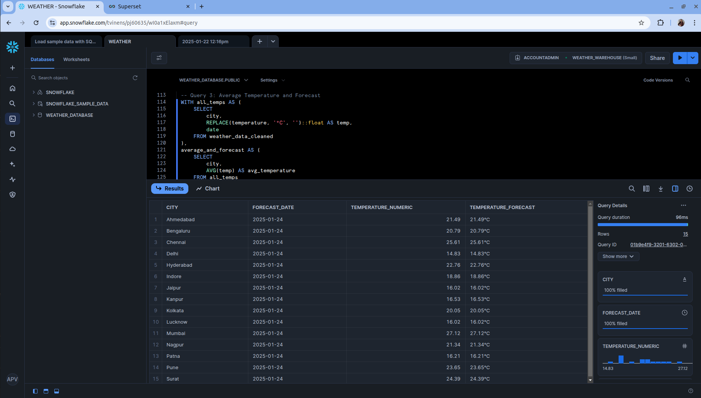
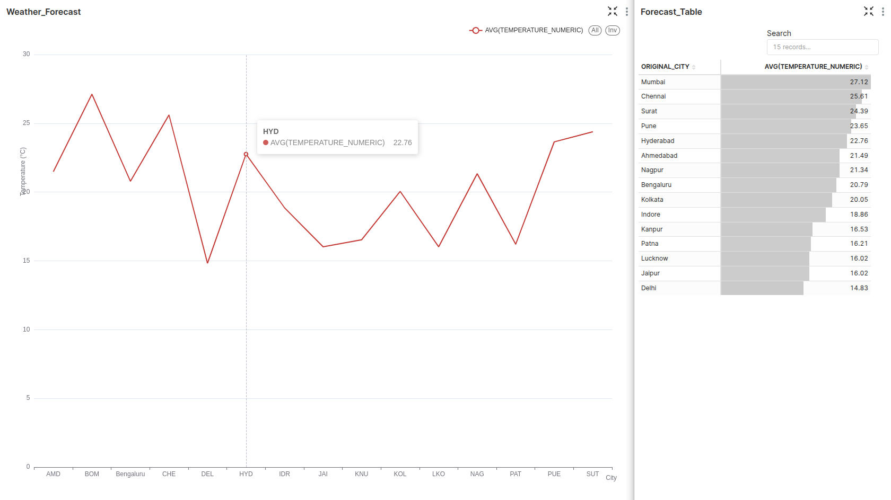

🌦️ Automated Data Pipeline 🌦️

A fully automated end-to-end workflow for processing and analyzing weather data using AWS and Snowflake.

# Architecture Diagram

- The pipeline uses the OpenWeather API to retrieve weather data with an API key. Here, I choose City, Temperature, Weather, Humidity, Timestamp, and Date.

- Weather data is retrieved and processed daily through an *AWS Lambda* function, triggered by *EventBridge*, and then stored in *DynamoDB*.

# DynamoDB Output

- DynamoDB Streams captures and records changes made to a DynamoDB table (e.g., inserts, updates, and deletes). This feature allows you to track all the changes made to the data. The streamed data is processed by a second Lambda function that transfers the processed data to an S3 bucket.

# S3 Output

- To enable interaction between S3 and Snowflake, a storage integration is created to establish a secure connection between Snowflake and the S3 bucket using an IAM role, and a Snowflake stage is set up to allow Snowflake to read files directly from the S3 bucket.

- New data added to the S3 bucket triggers a *Snowpipe* through *SQS*, automatically ingests the data into Snowflake tables for further processing and analysis.

- Processes and transforms weather data, calculates the average temperature forecast for each city, and stores the results in a forecast table, all with proper user and network permissions.

# Snowflake Output

- Finally, Snowflake is connected to *Apache Superset* to create an interactive dashboard accessible on port 8088.The auto-refresh interval is set to automatically refresh your dashboard at the set interval to fetch new updates from Snowflake and keep the data live.

# Final Output

